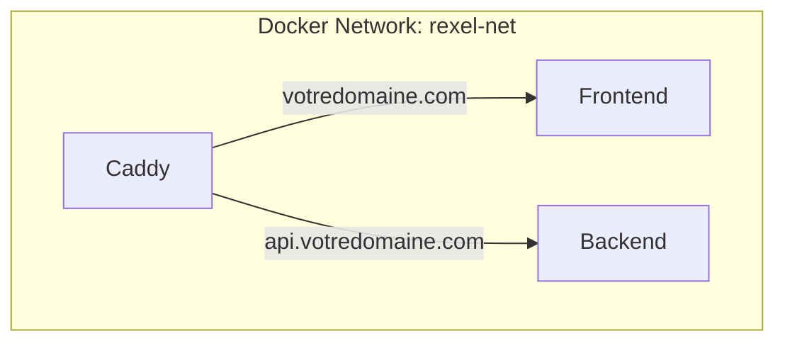

Excellente idée ! Centraliser Caddy sur le backend pour servir à la fois le frontend et le backend, tout en gardant les builds séparés, est une architecture très propre et courante en production. Voici un plan détaillé pour mettre cela en place :

---

# 📝 Plan : Mutualiser Caddy pour Frontend & Backend sur le même VPS

## 1. **Objectif**

- **Un seul Caddy reverse proxy** (dans le stack backend) gère HTTPS, le routage et les headers pour **les deux apps**.
- **Frontend et backend** sont dans des conteneurs séparés, chacun avec son propre `docker-compose`.
- **Pas de build du frontend dans le backend** : chaque projet build son image indépendamment.
- **Les deux stacks partagent un réseau Docker** pour permettre à Caddy d’atteindre le frontend.

---

## 2. **Étapes détaillées**

### 2.1. **Créer un réseau Docker partagé**

- Créer un réseau Docker nommé (ex: `rexel-net`) qui sera utilisé par les deux `docker-compose`.

### 2.2. **Adapter les docker-compose**

#### **Backend (`rexel-modern-backend/docker-compose.prod.yml`)**
- Ajouter le réseau `rexel-net` à tous les services (backend, caddy, etc).
- Caddy doit être sur ce réseau.

#### **Frontend (`rexel-modern/docker-compose.prod.yml`)**
- Ajouter le réseau `rexel-net` au service frontend (Next.js).
- **Ne pas inclure Caddy** dans ce compose.

### 2.3. **Adapter le Caddyfile du backend**

- Ajouter un bloc pour le domaine du frontend (`votredomaine.com`).
- Proxy les requêtes vers le conteneur frontend (ex: `frontend:3000`).
- Garder le bloc API/backend existant.

### 2.4. **Déploiement**

- Démarrer le réseau partagé (une seule fois) :  
  `docker network create rexel-net`
- Démarrer le backend (`docker-compose -f docker-compose.prod.yml up -d`)  
  (il va créer Caddy, backend, etc.)
- Démarrer le frontend (`docker-compose -f docker-compose.prod.yml up -d`)  
  (il va créer le conteneur Next.js, sur le même réseau)

### 2.5. **Variables d’environnement**

- Adapter les URLs internes dans les configs (ex: `http://frontend:3000` pour Caddy).
- Les URLs publiques restent inchangées (`https://votredomaine.com`, etc).

---

## 3. **Détail des fichiers à modifier/créer**

### 3.1. **Backend : `docker-compose.prod.yml`**
- Ajouter le réseau `rexel-net` à tous les services.
- Définir le réseau comme externe.

### 3.2. **Frontend : `docker-compose.prod.yml`**
- Ajouter le réseau `rexel-net` au service Next.js.
- Supprimer tout service Caddy éventuel.

### 3.3. **Caddyfile (backend)**
- Ajouter un bloc pour le frontend :
  ```caddyfile
  app.votredomaine.com {
      reverse_proxy frontend:3000
      # ...headers, gzip, etc.
  }
  ```
- Garder le bloc API/backend :
  ```caddyfile
  api.votredomaine.com {
      reverse_proxy backend:3333
      # ...headers, etc.
  }
  ```

### 3.4. **Documentation**
- Expliquer le workflow de build/déploiement séparé.
- Expliquer la gestion du réseau partagé.

---

## 4. **Questions à clarifier avant exécution**

1. **Nom du réseau Docker** souhaité (`rexel-net` par défaut ?)
2. **Nom du service frontend** dans le compose frontend (`frontend` ?)
3. **Ports exposés** côté frontend (toujours 3000 ?)
4. **Domaines exacts** à router (ex: `app.votredomaine.com`, `api.votredomaine.com`)
5. **Gestion des builds** : chaque pipeline CI build/push son image, puis déploiement manuel/automatique sur le VPS ?

---

## 5. **Résumé du flux**



---

**Veux-tu valider ce plan ou répondre aux questions ci-dessus avant que je génère les fichiers et instructions ?**